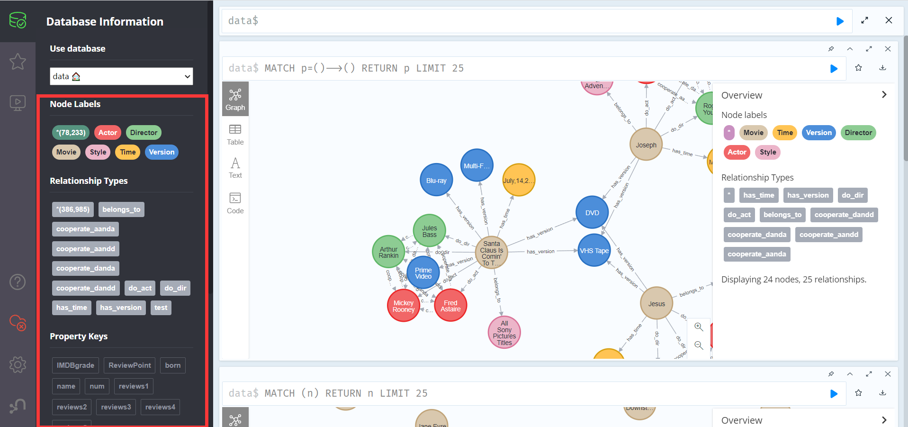
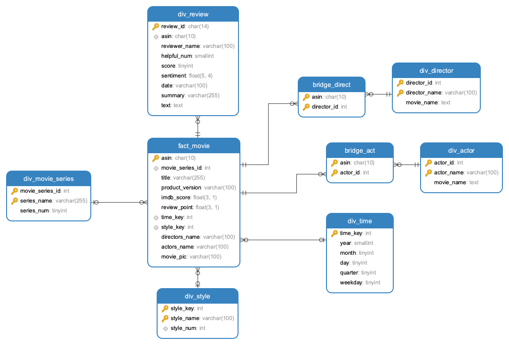

# DataWarehouse


## ETL

### 概览

​	项目数据来源：使用[https://nijianmo.github.io/amazon/index.html](https://nijianmo.github.io/amazon/index.html)的 “Small” subsets for experimentation 中的 Movies and TV 5-core 一共3,410,019条用户商品评论信息，利用数据中的“asin”字段对亚马逊页面进行信息爬取。

​	在对其中的“asin”字段进行去重处理后，总共得到了60172条不重复的asin数据，保存为csv文件；通过亚马逊商品页面中的imdb标签对商品进行区分，判断其是否是电影；采用IP代理池和python线程池来提高爬取的效率；数据存储采用三种不同数据库：MySQL、Neo4j、Hive，综合对比不同数据库的查询性能差异

>### ETL使用教程
>
>ETL项目整体按照ETL（extract、transform、load）的流程搭建，首先需要在ETL文件目录下运行以下命令安装python脚本所需要的依赖包。
>
>```python
>pip install -r requirements.txt
>```
>
>其次运行run.py文件
>
>```python
>python run.py
>```
>
>需要注意的是，我们使用了外部IP代理池，在运行爬虫前，需要配置好代理池并运行（代理池没有提交）。


### Extract

+ #### 爬虫

  + 首先对源数据进行处理之后，得到其asin字段的csv文件，利用其asin字段构造一系列Amazon商品页面的url 

    ```python
    asin = "157252765X"
    url = 'https://www.amazon.com/dp/ + asin
    ```

  + 使用request库发送请求

    ```python
    strhtml = requests.get(url, headers=web_header, cookies=cookies, proxies={"http": "http://{}".format(proxy)})
    ```
    需要注意的是，爬取亚马逊的页面必须要包括基本的请求头以及cookies等基本内容，否则无法大量爬取
    
  + 使用lxml和beautifulsoup库解析网页，通过selector获取相关字段
  
    ```python
    soup = BeautifulSoup(strhtml.text, 'lxml')
    movie_title = str(soup.select('title')[0].getText())
    ```
    
  + 使用python线程池
    
    ```python
    with ThreadPoolExecutor(8) as t:
        for item in reader:
            if reader.line_num < 2:
                continue
            if reader.line_num > 15000:
                break
            url = 'https://www.amazon.com/dp/' + item[0]
            future = t.submit(download_one_page, url, reader.line_num)
            future.add_done_callback(executor_callback)
            t.shutdown()
    ```
    
    相比python多线程，线程池可以提供更加方便的使用策略，线程池中的线程是重复使用的，在其分配的任务被完成完成后，它会继续被分配任务；而多线程需要重复启动线程，这样会浪费系统资源
    
    需要注意的是，在线程中的错误是不会被影响到主线程，也就是说，子线程出现错误后会被分配下一个任务，而主线程不会终止，自然也没有错误输出
    
  +  使用IP代理池
    
    在不使用IP代理池时，爬取过程只能维持短时间（20～30min）的高成功率（85%以上），之后单次爬取的成功率会降低到（10%）以下，但当切换IP之后（使用手机热点等），其爬取成功率会恢复，但在上述时间之后，爬取成功率仍然会大幅降低。同一个IP需要暂停一段时间才能重新恢复到初始状态，但具体时间无法得知，（上限可知：超过12h）
    
    所以需要进行IP代理来提高长时间段内的爬取成功率：
    
    [proxy_pool](https://github.com/jhao104/proxy_pool)
    
    [ProxyPool](https://github.com/Python3WebSpider/ProxyPool)
    
    使用了以上两个代理池进行了可用代理IP的获取，具体使用过程请点击链接查看
    
    但上述IP池的数量并不是非常充足，因此采用了“先使用一个ip，当其爬取成功率降低到一定程度时，换用另一个ip“的策略
    
    
  
+ #### 数据暂存策略

  由于需要爬取的页面众多，不能一次性爬取完毕，所以在asin的csv文件中增加一列，用于记录已经爬取过的，或是已经确认不是movie的asin，这样可以多次关停程序，间断的爬取数据

### Transform

+ #### 电影系列判定

  采用Levenshtein距离算法，计算两个电影名称的相似度，同时根据实际情况设置不同情况的权重，比如减少长度相差过大的电影名称的相似度，降低某些无意义的单词（“The”， “At”）的权重，最后选取某一个相似度的界限，当相似度超过该值时，视两部电影为一个系列

+ #### 评论情感分析

  用户对电影的情感态度也是对电影的一项评价指标，我们对用户评论体现出的情感状态进行分析。这里我们参考了一个简单的pytorch情感分析模型（https://github.com/bentrevett/pytorch-sentiment-analysis），经过训练后应用到电影对应的评论数据中，为每条评论计算出一个情感得分，得分越高，意味着用户对这部电影的态度越积极。

+ #### 其他

### Load

#### MySQL

存储数据库安装在Centos8.2的阿里云服务器上，因为存储时需要计算电影系列，时间复杂度是$O(n^2)$，因此存储脚本选择在服务器上挂起执行，节约本机资源

#### Neo4j

1.neo4j图数据库储存规模




2.知识图谱实体类型

| 实体类型 | 中文含义     | 实体数量 | 举例          |
| -------- | ------------ | -------- | ------------- |
| Movie    | 电影名称     | 32929    | The Crossing  |
| Actor    | 演员         | 25297    | Laura Bailey  |
| Director | 导演         | 13370    | Chris Fisher  |
| Style    | 电影类型     | 372      | Genesis       |
| Version  | 电影版本     | 35       | DVD-ROM       |
| Time     | 电影上映时间 | 6230     | April,25,2018 |

3.知识图谱实体关系类型

| 实体关系类型    | 中文含义       | 关系数量 | 举例           |
| --------------- | -------------- | -------- | -------------- |
| belongs_to      | 属于类型       | 34102    | 电影属于类型   |
| do_act          | 演电影         | 60337    | 演电影         |
| do_dir          | 导电影         | 30407    | 导电影         |
| cooperate_aandd | 演员和导演合作 | 48659    | 演员和导演合作 |
| cooperate_danda | 导演和演员合作 | 48659    | 导演和演员合作 |
| cooperate_aanda | 演员和演员合作 | 47788    | 演员和演员合作 |
| cooperate_dandd | 导演和导演合作 | 6408     | 导演和导演合作 |
| has_version     | 电影的版本     | 76512    | 电影的版本     |
| has_time        | 电影的上映时间 | 34101    | 电影的上映时间 |

4.知识图谱属性类型

| 属性类型    | 中文含义   | 举例                                                         |
| ----------- | ---------- | ------------------------------------------------------------ |
| IMDB grade  | IMDB评分   | 7.2                                                          |
| reviews1    | 5条评价    | This film is OK IF YOU WANT A QUICK LESSON ON HIS LIFE. They skip over many things....... |
| reviews2    | 5条评价    | This film is OK IF YOU WANT A QUICK LESSON ON HIS LIFE. They skip over many things....... |
| reviews3    | 5条评价    | This film is OK IF YOU WANT A QUICK LESSON ON HIS LIFE. They skip over many things....... |
| reviews4    | 5条评价    | This film is OK IF YOU WANT A QUICK LESSON ON HIS LIFE. They skip over many things....... |
| reviews5    | 5条评价    | This film is OK IF YOU WANT A QUICK LESSON ON HIS LIFE. They skip over many things....... |
| ReviewPoint | 评价平均分 | 5.0                                                          |

| 关系属性           | 合作次数           |
| ------------------ | ------------------ |
| cooperate_aanddnum | 演员和导演合作次数 |
| cooperate_aandanum | 演员和演员合作次数 |
| cooperate_danddnum | 导演和导演合作次数 |

在现实世界中，除数据本身之外，数据与数据之间联系的重要性也是非同小可，然后传统的关系型数据库并不能很好的表现数据之间的联系，而一些非关系型数据库又不能表现数据之间的联系，但同样是NoSQL的Neo4j图数据库是以图的结构形式来存储数据的，它所存储的就是联系的数据，是关联数据本身。Neo4j是一个高性能的NOSQL图形数据库，它将结构化数据存储在网络上而不是表中。它是一个嵌入式的、基于磁盘的、具备完全的事务特性的Java持久化引擎，但是它将结构化数据存储在网络（从数学角度叫做图）上而不是表中。Neo4j也可以被看作是一个高性能的图引擎，该引擎具有成熟数据库的所有特性。

在一个图中包含两种基本的数据类型：**Nodes（节点）** 和 **Relationships（关系）**。**Nodes 和 Relationships** 包含key/value形式的属性。Nodes通过Relationships所定义的关系相连起来，形成关系型网络结构。

本次项目中希望对电影及其周边信息进行统计和分析，希望通过合理的数据模型构建以及后期的合理优化以达到良好的查询效率。

##### 优化方案

1. **增加信息冗余，以空间换时间，可是适当提升查询效率。**将电影的主演、导演、及共多少版本等信息作为电影节点属性冗余存储，当需要根据电影名称查询演员或其他相关信息时，无需再通过关系去寻找目标节点，这时可直接通过查询电影节点属性获得相关值。

2. **为某些关系设置某些属性，方便查询。**在查询合作次数最多的导演和导演，合作次数最多的演员和导演，合作次数最多的演员和演员等中直接查询关系相应的合作次数进行比较后，按照要求选取top100等。查询关系为O(n)，排序为调用neo4j中的排序。

3. **如果配置够好的话(或者开启虚拟内存)，为neo4j内存分配尽可能大。**在配置文件中neo4j的默认设置为dbms.memory.heap.initial_size=512m；dbms.memory.heap.max_size=512m，根据硬件配置，做合适的修改（最大堆内存越大越好，但是要小于机器的物理内存）

4. **对合适的数据进行拆分，即变为多个维度**。在本次项目中，在查询业务中有针对某年，某月，某日新增电影的查询。将上映时间变为年，月，日，等维度(即list)，那么在针对时间对电影进行查询时就可以实现更高的查询效率。

   

#### Hive

1.Hive简介

Hive最初是Facebook为了解决海量日志数据的分析而开发的，后来开源给了Apache软件基金会。根据官网定义，Hive其实就是一种用类SQL语句来协助读写、管理那些存储在分布式存储系统Hadoop上大数据集的数据仓库软件。

> The Apache Hive ™ data warehouse software facilitates reading, writing, and managing large datasets residing in distributed storage using SQL. Structure can be projected onto data already in storage. A command line tool and JDBC driver are provided to connect users to Hive.


2.Hive的几个特点

- Hive最大的特点是通过类SQL来分析大数据，而避免了写MapReduce程序来分析数据，这样使得分析数据更容易。
- 数据是存储在HDFS上的，Hive本身并不提供数据的存储功能
- Hive是将数据映射成数据库和一张张的表，库和表的元数据信息一般存在关系型数据库上（比如MySQL）。
- 数据存储方面：它能够存储很大的数据集，并且对数据完整性、格式要求并不严格。
- 数据处理方面：因为Hive语句最终会生成MapReduce任务去计算，所以不适用于实时计算的场景，它适用于离线分析。

3.Hive写入数据的方式

与Oracle、Mysql等我们熟悉的关系型数据库不同，早期版本的Hive并不支持*INSERT INTO table_name VALUES (value1,value2,value3,...);*这样使用insert语句直接插入一组记录的语句形式。自Hive 0.14之后，Hive支持使用下列格式的语句直接从SQL向表中插入数据。值得注意的是，VALUES子句列出的每一行都会插入到表中且必须为表中的每一列提供值。此外，Hive不支持复杂类型（数组、映射、结构、联合）的文字，因此不可能在INSERT子句中使用它们。这意味着用户不能使用INSERT子句将数据插入到复杂数据类型的列中。综上，虽然新版本的Hive支持INSERT语句，但性能和可用性方面难以满足要求。

```sql
CREATE TABLE students (name VARCHAR(64), age INT, gpa DECIMAL(3, 2))
  CLUSTERED BY (age) INTO 2 BUCKETS STORED AS ORC;
 
INSERT INTO TABLE students
  VALUES ('fred flintstone', 35, 1.28), ('barney rubble', 32, 2.32);
```

前面也提过，Hive的数据是存储在分布式文件系统HDFS上的，且Hive中的表可看作是对HDFS上结构化数据的一个映射。所以Hive也支持从文件系统中导入数据到表中等多种形式的数据写入方式。

**从本地文件系统中导入数据到Hive表**

```sql
load data local inpath 'xxx.txt' into table xxx；
```

**从HDFS上导入数据到Hive表**

```sql
load data inpath '/home/xxx/add.txt' into table xxx;
```

**从别的表中查询出相应的数据并导入到Hive表中**

```sql
insert overwrite table xxx partition(dt='18-09-26') select uid,model,key,value,time from yyy where dt='18-09-26';
```

**在创建表的时候通过从别的表中查询出相应的记录并插入到所创建的表中**

```sql
create table xxx as select id, name, tel from yyy;
```

本项目中选择从HDFS中导入数据到Hive表中，这种方式速度更快效率更高。


若想将数据导入非默认格式的Hive表中，比如ORC格式的Hive表中，则需要先创建一张临时表，并将数据通过文件导入的形式导入临时表中。再通过查询导入的方式将数据导入其他格式的表中。从实验截图可以看到，sql查询导入语句在执行时被转化为了mapreduce程序，所以其他格式的数据导入比默认的TEXTFILE格式更加复杂。


## 数据存储设计说明

### 整体存储模式

在关系型数据库的存储中，所有的所有的电影信息均被储存，并且对所有的查询接口进行了实现，但是对于关系型数据库，查询表于表之间的关系相对较慢，但是对于单个表上的字段的筛选较快。因此，在查询关系类的信息时，采用了图数据库的查询

### 关系型存储

关系型存储采用了MySQL，MySQL是现在最为常用几种关系型数据库之一，它对比其他的几种大型商业数据库来说，如Oracle， DB2和Sybase，非常的简单易用，同时MySQL的性能也非常稳定，很少出现宕机，同时也易于维护，安装。关系型数据库也是我们最常接触的几种数据库之一，对于相关的问题也网络上也有相当多的解答

+ #### ER图设计

  

  存储的设计中，我们采用了具有部分冗余的星型模型作为关系型数据库MySQL的存储模型，这种模型是不符合规范的数据库设计，但是这种设计能够在频繁查询中提供较好的性能，相比之下，雪花模型在存储时，没有存储冗余的数据，在查询相关的数据时，往往需要在多个表的信息中进行搜索，因此更新查询星型模型会快于雪花模型。

+ #### 数据库er图

  

  在数据库表中，分为一个事实表`fact_movie`和多个维度表`div_review`、`div_movie_series`、`div_style`、`div_actor`、`div_director`

  在各个表中存储了基础的冗余信息，便于查询操作，比如在`fact_movie`中存储了其电影的演员和导演信息、在导演和演员的表中存储了其演过的电影的信息，在时间表中存储了季度以及星期几的信息，在风格表和电影系列表中存储了电影数量的信息

+ #### 存储优化策略

  + ##### 字段类型选择

    在存储数据库的各信息时，尽可能的减少字段的浪费，对于各数据表的主键，均采用`int`类型，对于其余类型的主键，尽可能的设置少的字段来，比如在时间表中，除了主键外，均采用`tinyint`作为字段类型

  + ##### 字段冗余存储

    在各个表中存储了基础的冗余信息，便于查询操作，比如在`fact_movie`中存储了其电影的演员和导演信息、在导演和演员的表中存储了其演过的电影的信息，在时间表中存储了季度以及星期几的信息，在风格表和电影系列表中存储了电影数量的信息

  + ##### 索引

    对于各数据表，均设置了索引，来提高查询性能

    设置BTREE索引：

    

    设置HASH索引：

    

    未设置索引：

    

### 分布式存储

- #### 存储模型

前文提到过，Hive的存储是建立在Hadoop文件系统之上的，因此Hive本身没有专门的数据存储格式，也不能为数据建立索引，只需要在创建表的时候指定数据中的列分隔符和行分隔符就可以解析数据。因此，Hive存储模型采用和Mysql一样的冗余存储。

- #### 存储优化策略

  ##### 资源优化

  Hive的运行建立在分布式系统Hadoop之上，因此Hadoop本身的节点数量也是影响Hive查询的重要因素。我们使用各自的笔记本电脑搭建了一个拥有四个节点（一个主节点，三个从节点）的完全分布式云系统，对数据查询进行测试，并和在只有单个节点的伪分布式系统上的查询结果进行对比。实验结果显示，在四节点的分布式系统上两次查询的时间都约在50毫秒左右，而单节点伪分布式的查询时间约在500多毫秒左右，可以得出结论增加分布式系统的节点数量会显著增加Hive查询的效率。

  

  

  ##### 四节点完全分布式查询时间

  

  **单节点伪分布式查询时间**

  

  此外，物理机器本身的一些参数，如内存等也会影响Hive的查询。我们通过在单节点伪分布式系统机器上开启虚拟内存来模拟内存增加的情况，并对数据进行查询和对比。在实际云服务器测试中，服务器共2G内存，在未开启虚拟内存的情况下，发送查询请求时偶尔会由于内存不足而卡住宕机。为了解决内存不足，我们为服务器开启了10G的虚拟内存，实验截图显示，虚拟内存已开启且使用了400M左右，且这使用的虚拟内存远大于剩余的物理内存，可见在总内存容量较小的情况下，增加内存容量可以提高查询的性能，保证查询服务的稳定。

  

  

  ##### 文件格式优化

  Hive的文件存储格式包括以下几类：TEXTFILE、SEQUENCEFILE、RCFILE、ORCFILE。其中TEXTFILE为默认格式，建表时不指定则默认为这个格式，导入数据时会直接把数据文件拷贝到hdfs上不进行处理。而SEQUENCEFILE，RCFILE，ORCFILE格式的表不能直接从本地文件导入数据，数据要先导入到TEXTFILE格式的表中， 然后再从表中用insert导入SEQUENCEFILE、RCFILE、ORCFILE表中。

  ###### TEXTFILE

  默认格式，数据不做压缩，磁盘开销大，数据解析开销大。可结合Gzip、Bzip2使用(系统自动检查，执行查询时自动解压)，但使用这种方式，hive不会对数据进行切分，从而无法对数据进行并行操作。

  ###### SEQUENCEFILE

  SequenceFile是Hadoop API提供的一种二进制文件支持，其具有使用方便、可分割、可压缩的特点。SequenceFile支持三种压缩选择：NONE，RECORD，BLOCK。Record压缩率低，一般建议使用BLOCK压缩。
  
  ###### RCFILE

  RCFILE是一种行列存储相结合的存储方式。首先，其将数据按行分块，保证同一个record在一个块上，避免读一个记录需要读取多个block。其次，块数据列式存储，有利于数据压缩和快速的列存取。RCFile保证同一的数据位于同一节点，因此元组重构代价较低(需要将分散的数据重新组织,比如一列数据散落在不同集群，查询的时候，需要将各个节点的数据重新组织；但是如果数据都在一个机器上，那就没有必要重新组织)。RCFile通过列进行数据压缩，因为同一列都是相同的数据类型，所以压缩比比较好。RCFile可以跳过不必要的列读取。
  
  ###### ORC File

  ORCFile存储格式，就是Optimized RC File的缩写。意指优化的RCFile存储格式。相比RCFILE，ORC FILE具有如下特点：每一个任务只输出单个文件，这样可以减少NameNode的负载；支持各种复杂的数据类型，比如datetime,decimal,以及复杂的struct,List,map等；在文件中存储了轻量级的索引数据；基于数据类型的块模式压缩：比如Integer类型使用RLE(RunLength Encoding)算法，而字符串使用字典编码(DictionaryEncoding)；使用单独的RecordReader并行读相同的文件；无需扫描标记就能分割文件；绑定读写所需要的内存；元数据存储使用PB,允许添加和删除字段。

  我们主要对默认的TEXTFILE格式和ORCFILE格式在数据存储和数据查询方面进行对比，使用的查询语句如下所示。通过实验结果可以看出，ORC格式的文件存储大小更小，仅有默认TEXTFILE文件格式的三分之一。而且查询速度也更加迅速，比TEXTFILE文件格式快了442毫秒，即0.4秒，可见在规模更大的数据体量下，查询效率会得到可观的提升。
  
  ```sql
  select * from fact_movie where title LIKE "Shadows%"
  ```
  
  ```sql
  select * from fact_movie_orc where title LIKE "Shadows%"
  ```
  
  **TEXTFILE格式的文件大小和查询时间**
  <<<<<<< Updated upstream

  

  

  **ORC格式的文件大小和查询时间**

  

  
  =======
  
  
  
  
  
  **ORC格式的文件大小和查询时间**
  
  
  
  
>>>>>>> Stashed changes

### 图数据存储


## 项目报告


### 数据查询程序


#### 前端程序

前端采用了常用的Vue + Element UI的方法，调用后端接口进行数据获取和展示，进行查询的性能对比，使用e-chart图形化展示查询结果

[前端仓库地址](https://github.com/zb2313/DW_frontend)

[前端项目地址](http://139.196.202.57:8090/)


#### 后端程序

后端整体使用Spring Boot， 使用hibernate作为数据持久化框架，数据查询操作使用Spring Data JPA

[后端仓库地址](https://github.com/Wizard23333/DataWarehouseBackend)

##### 实现接口

+ 11个时间查询接口，包括各种组合类型的接口
+ 4个电影类接口，包括模糊查询和精确查询
+ 8个导演演员接口，查询基本信息和合作信息
+ 8个合作查询接口，查询经常合作的人员信息
+ 5个组合查询接口，通过两种参数进行查询

##### 查询示例

+ 类别统计


+ 分数统计


+ 参演电影随时间变化


+ 参演电影类别统计


+ 类别年份统计


+ 类别分数统计


### 存储优化分析

+ 对于一般的查询，比如查询某年某月有哪些电影，某个季度有哪些电影，某个类别有哪些电影，采用MySQL数据库比较迅速，如果在图数据库上执行相关的查询，速度较慢，因为不能直接对节点进行查询，首先需要查询关系，才能再查询节点的数据
+ 对于有多种关联的数据查询，比如查询经常合作的导演的榜单，经常合作的演员的榜单，需要使用图数据库Neo4j进行查询，使用MySQL进行查询的时候，需要多次查询多张数据表，再进行统计排序操作，因此时间复杂度较高；而对于图数据库，则只需要查询关系即可，因此查询速度较快
+ 在查询的时候，如果有设置有数据的冗余，则应选择冗余数据进行查询，这样相比一般的查询，不需要进行多张表的查询；同时在查询的时候，应该注意join的使用，如果两张表的数据量都非常大，join操作可能导致服务器的内存不够

+ ⭕️⭕️⭕️⭕️⭕️

### 数据质量分析

+ 在数据extract过程中，爬取网页时亚马逊页面会有两种显示页面，在爬取的初始阶段会是一般的商品页面，但当爬取过程进行一段时间后，亚马逊会返回另一种页面，这种页面和前一种页面不同，在一般的正常访问中不会显示。这两种页面显示的内容有所不同，因此我们在数据爬取的过程中选取了两种页面信息的交集部分，来提高数据的完整性和可信度
+ 在数据transform的过程中，有许多的数据并不是非常完整，比如没有上映时间，没有版本信息，版本分类比较随意等等。对于上映时间，如果没有，则选取最早的一条评论的时间作为上映时间。对于商品的Title处理不太完整，可能会带有商品版本信息，没有将电影名完全抽取出来，等等
+ 由于第二种亚马逊页面的限制，爬取到的演员数量偏少，可以考虑引入第三方数据源。在筛选电影数据中，我们选择了有imdb评分的商品，可能会疏漏一些电影。

### 数据血缘分析

大数据时代，数据爆发性增长，海量的、各种类型的数据在快速产生。这些庞大复杂的数据信息，通过联姻融合、转换变换、流转流通，又生成新的数据，汇聚成数据的海洋。

数据的产生、加工融合、流转流通，到最终消亡，数据之间自然会形成一种关系。我们借鉴人类社会中类似的一种关系来表达数据之间的这种关系，称之为数据的血缘关系。与人类社会中的血缘关系不同，数据的血缘关系还包含了一些特有的特征：

- **归属性**：一般来说，特定的数据归属特定的组织或者个人，数据具有归属性。
- **多源性**：同一个数据可以有多个来源（多个父亲）。一个数据可以是多个数据经过加工而生成的，而且这种加工过程可以是多个。
- **可追溯性**：数据的血缘关系，体现了数据的生命周期，体现了数据从产生到消亡的整个过程，具备可追溯性。
- **层次性**：数据的血缘关系是有层次的。对数据的分类、归纳、总结等对数据进行的描述信息又形成了新的数据，不同程度的描述信息形成了数据的层次。

#### 应用场景

+ 可以从一个演员出发，分析他演过的所有电影的信息，以及他合作过个导演和演员信息等
+ 可以从一个电影出发，寻找这个电影参演的所有演员和导演，及他们演过的其他电影

### 组员及分配比例
